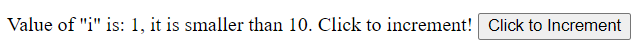

# HTMX Serverless Client States   

To use HTMX you require a back-end server to handle the XHR requests and responses. In some cases it is nice to have only a client side interaction to handle client states, **without network requests**.

This extension uses the HTMX built-in Events to intercept some XHR requests before they fire and define response texts on the client side. No need for mock or "fake" server scripts. It is **HTMX without a server** (sort of).

## Usage

### In HTML head

```html
<!-- htmx  -->
<script src="https://unpkg.com/htmx.org"></script>
<!-- serverless extension -->
<script src="https://unpkg.com/htmx-serverless"></script>
```

Then use the `window.htmxServerless` global to set custom handlers and responses.

```javascript
// Requests to "/handler1" are replaced with "<div>Custom HTML</div>"
htmxServerless.handlers.set('/handler1', '<div>Custom HTML</div>');

// Requests to "/handler2" are managed via a function
htmxServerless.handlers.set('/handler2', function(text, params, xhr){
    console.log(this, text, params, xhr);
    return "<p>Okay!</p>";
});
```

### In custom bundles

```javascript
import htmx from "htmx.org";
import htmxServerless from "htmx-serverless";

// Initialize on your local htmx
htmxServerless.init(htmx);
```

## Examples

### Handler as a string

Assume we have a button with the `serverless` **hx-ext** sattribute, which triggers a request to the path "/clicked":

```html
<button hx-get="/clicked" hx-swap="outerHTML" hx-ext="serverless">
    Click to replace!
</button>
```

To define a serverless client side response to "/clicked" in the handlers Map():

```javascript
htmxServerless.handlers.set('/clicked', 
    `<button hx-get="/clicked" hx-swap="outerHTML" hx-ext="serverless">
        Hey, you clicked me!
    </button>`
);
```

The button is then replaced with the HTML defined without triggering a request to the server. It's that simple.

[Try this example here.](https://jsfiddle.net/ernestmarcinko/h0rj5pez/1/)

### Handler as a Function

Tha handler function is a great tool for more complex conditional logic, like it would happen on the server side.
Let's make a simple click based number increment handler:

```html
<span class="counter"></span>
<button hx-get="/example" 
        hx-target="previous .counter" 
        hx-trigger="load, click" 
        hx-vals='js:{myVal: i++}' 
        hx-ext="serverless">Click to Increment</button>
   
```

The handler only needs to print the text as "i" is incremented by hx-vals automatically:

```javascript
let i = 0;
htmxServerless.handlers.set('/example', function(text, params, xhr){
    let status = params?.myVal < 10 ? "smaller" : "bigger";
    return `Value of "i" is: ${i}, it is ${status} than 10`;
});
```

[Try this example here.](https://jsfiddle.net/ernestmarcinko/vzpawq0y/1/)

Output:



## Handler function

The handler function accepts 3 parameters (4 including "this") and returns a string:
 * **this** => The target element
 * **ext** => The replacement text (empty)
 * **params** => The GET/POST or xhr-vals arguments
 * **xhr** => The current request

```javascript
/**
 * The handler function
 * 
 * @param this:Element The target element
 * @param text:string The replacement text (empty)
 * @param params:Object The GET/POST or xhr-vals arguments
 * @param xhr:XMLHttpRequest The current request
 * 
 * @returns string
 */ 
function handler(text, params, xhr){
    console.log(this, text, params, xhr);
    return 'Hi!';
}
htmxServerless.handlers.set('/example', handler);
```

## How does it work?
It is really simple:
- The XHR request will not be sent, the ```.send()``` method is overridden for the intercepted request
- The XHR ```loadstart```, ```load``` and ```loadend``` events are dispatched instead, as if the request was finished "successfully"
- Only requests added to the ```htmxServerless.handlers``` Map are intercepted
- Requests are intercepted based on the request path, request arguments does not matter

## What else?

Nothing actually. This is only a baseline solution, but it works. There are no fancy features, as htmx is oath to be a small but effective library. With some creativity, you could make this more convenient, I leave it up to you :)